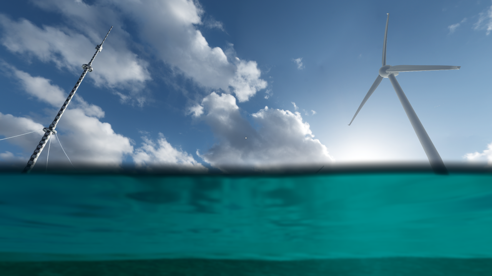

# Water Transition Shader
A simple water transition post processing effect.

This is the official plugin page. See https://github.com/bifractal/godot-water-transition-example/tree/plugin for a complete example project.

## Plugin Setup
* Copy folder **bifractal-water-transition-shader** from **addons/** to your project's addon folder.
* Enable plugin **Water Transition Shader** via project settings.
* Add node **WaterTransitionShader** to the main scene root via **Add Child Node**.
* Adjust properties (water level etc.) or use the default values.
* Click on **Instance Child Scene** and search for **WaterPlane.tscn** from the addon folder to add a basic water shader plane mesh.

Make sure to match the water plane's y-translation with the water level property!

If the post processing effect is on top of your control nodes, try to move the water transition shader node up inside your scene node hierarchy. If you make use of cull masks or layer masks at bit 15 (layer 16) anywhere else in your game, try another mask value.
